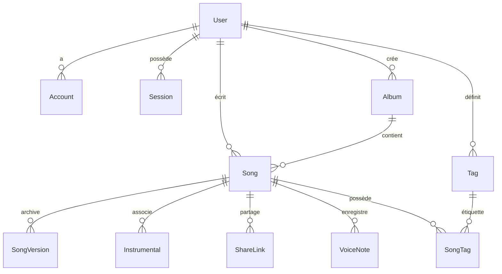

# Modèle de Données Relationnel: Verso Core Platform

Ce document spécifie le schéma relationnel complet pour PostgreSQL via Prisma ORM, les règles de validation, les contraintes d'intégrité et les transitions d'état.

---

## 1. Schéma des Entités (Prisma Schema Conceptuel)

---

## 2. Définition Détaillée des Entités

### 2.1 Authentification & Utilisateurs

#### `User`
L'auteur ou rappeur propriétaire de son compte et de ses œuvres.
- `id`: UUID (Clé primaire)
- `email`: String (Unique, indexé, normalisé en minuscules)
- `passwordHash`: String? (Hash Argon2id fort, nullable pour les comptes exclusivement OAuth)
- `emailVerified`: DateTime? (Horodatage de la validation d'email, null si non vérifié)
- `displayName`: String? (Nom d'artiste / pseudonyme)
- `themePreference`: Enum (`LIGHT`, `DARK`, `SYSTEM`, défaut: `SYSTEM`)
- `createdAt`: DateTime (Défaut: `now()`)
- `updatedAt`: DateTime (Mis à jour automatiquement)

*Contraintes & Règles :*
- Les mots de passe en clair ne sont jamais persistés.
- Tout compte sans `emailVerified` conserve l'accès à l'écriture mais affiche une bannière d'avertissement.

#### `Account`
Comptes de fournisseurs d'authentification tierce (OAuth) liés à un utilisateur.
- `id`: UUID (Clé primaire)
- `userId`: UUID (Clé étrangère vers `User.id`, cascade delete)
- `provider`: Enum (`GOOGLE`, `ORCID`)
- `providerAccountId`: String (Identifiant unique chez le fournisseur)
- `createdAt`: DateTime (Défaut: `now()`)

*Contraintes & Règles :*
- Clé unique composite : `@@unique([provider, providerAccountId])`.
- Un même utilisateur peut avoir un compte local et plusieurs comptes OAuth liés.

#### `Session`
Sessions utilisateur persistées en base de données pour les cookies sécurisés.
- `id`: String (Clé primaire, identifiant aléatoire cryptographique de 32 octets encodé en hex/base64)
- `userId`: UUID (Clé étrangère vers `User.id`, cascade delete)
- `userAgent`: String? (Informations de l'appareil et navigateur)
- `ipAddress`: String? (Adresse IP indicative pour l'audit)
- `expiresAt`: DateTime (Date d'expiration stricte)
- `createdAt`: DateTime (Défaut: `now()`)
- `lastActiveAt`: DateTime (Horodatage de la dernière requête)

*Contraintes & Règles :*
- Vérifiée à chaque requête authentifiée : `WHERE id = :sessionId AND expiresAt > now()`.
- Révocable individuellement ou en masse par l'utilisateur.

#### `EmailToken`
Jetons cryptographiques temporaires pour la validation d'email et la réinitialisation de mot de passe.
- `id`: UUID (Clé primaire)
- `email`: String (Adresse email ciblée)
- `tokenHash`: String (Hash SHA-256 du token aléatoire émis)
- `type`: Enum (`VERIFY_EMAIL`, `RESET_PASSWORD`)
- `expiresAt`: DateTime (Durée: 24h pour vérification email, 1h pour réinitialisation)
- `usedAt`: DateTime? (Horodatage d'utilisation, usage unique strict)
- `createdAt`: DateTime (Défaut: `now()`)

---

### 2.2 Textes, Versions & Albums

#### `Album`
Regroupement ordonné de morceaux constituant un projet musical (album, EP, mixtape).
- `id`: UUID (Clé primaire)
- `userId`: UUID (Clé étrangère vers `User.id`, cascade delete)
- `title`: String (Titre du projet, max 200 caractères)
- `description`: String? (Notes de présentation, max 2000 caractères)
- `coverImageKey`: String? (Clé de référence de l'image de pochette sur le stockage S3)
- `createdAt`: DateTime (Défaut: `now()`)
- `updatedAt`: DateTime

*Règles :*
- La suppression d'un album ne supprime jamais les textes associés (`onDelete: SetNull` sur `Song.albumId`).

#### `Song`
L'entité centrale contenant le texte, les couplets et les métadonnées de l'œuvre.
- `id`: UUID (Clé primaire)
- `userId`: UUID (Clé étrangère vers `User.id`, cascade delete, indexé)
- `albumId`: UUID? (Clé étrangère vers `Album.id`, nullable, `onDelete: SetNull`)
- `title`: String (Titre du texte, défaut: "Sans titre", max 200 caractères)
- `content`: Text (Contenu intégral des paroles, support des retours à la ligne)
- `status`: Enum (`DRAFT`, `COMPLETED`, défaut: `DRAFT`)
- `isFavorite`: Boolean (Défaut: `false`)
- `positionInAlbum`: Int? (Position ordonnée dans la tracklist de l'album)
- `createdAt`: DateTime (Défaut: `now()`)
- `updatedAt`: DateTime

*Règles d'intégrité :*
- Cloisonnement strict : chaque opération de lecture/écriture filtre impérativement par `userId`.
- Sauvegarde continue : `updatedAt` est rafraîchi à chaque modification de `content`.

#### `SongVersion`
Instantané immuable d'un texte pour l'historique et la preuve d'antériorité.
- `id`: UUID (Clé primaire)
- `songId`: UUID (Clé étrangère vers `Song.id`, cascade delete, indexé)
- `title`: String (Titre archivé)
- `content`: Text (Contenu archivé)
- `createdAt`: DateTime (Horodatage UTC précis de la révision)

*Règles de rétention :*
- Conservation intégrale et illimitée : aucune purge automatique, aucun plafond de nombre de versions.

#### `Tag` & `SongTag`
Système d'étiquetage par thème, humeur ou ambiance.
- `Tag`: `id` (UUID), `userId` (UUID), `name` (String, max 50 car.), `color` (String, code couleur hexa/nom)
  - `@@unique([userId, name])`
- `SongTag`: `songId` (UUID), `tagId` (UUID)
  - `@@id([songId, tagId])`

---

### 2.3 Audio, Partage & Mémos Vocaux

#### `Instrumental`
Pistes d'instrumentales associées à un texte.
- `id`: UUID (Clé primaire)
- `songId`: UUID (Clé étrangère vers `Song.id`, cascade delete, indexé)
- `title`: String (Nom de la piste, ex: "Prod principale", "Version sans drums", max 150 car.)
- `s3Key`: String (Clé d'objet unique sur le bucket compatible S3)
- `mimeType`: String (Strictement `audio/mpeg` ou `audio/wav`)
- `sizeBytes`: Int (Taille en octets, $\le 75 \times 1024 \times 1024$)
- `durationSeconds`: Float? (Durée totale en secondes)
- `bpm`: Int? (Tempo en battements par minute, ex: 90)
- `musicalKey`: String? (Tonalité, ex: "Cm", "F# min")
- `isActive`: Boolean (Défaut: `true` pour la première piste, indique la piste chargée par défaut dans le lecteur)
- `createdAt`: DateTime (Défaut: `now()`)
- `updatedAt`: DateTime

*Règles de quota :*
- Maximum 3 instrumentales associées par texte (`COUNT(Instrumental) <= 3`).

#### `ShareLink`
Lien de partage privé révocable en lecture seule.
- `id`: UUID (Clé primaire)
- `songId`: UUID (Clé étrangère vers `Song.id`, cascade delete, indexé)
- `tokenHash`: String (Unique, indexé, hash SHA-256 du token d'URL secret)
- `expiresAt`: DateTime? (Date d'expiration optionnelle)
- `isRevoked`: Boolean (Défaut: `false`, révocation instantanée)
- `accessCount`: Int (Compteur de consultations, défaut: 0)
- `lastAccessedAt`: DateTime?
- `createdAt`: DateTime (Défaut: `now()`)

*Règles d'accès :*
- Accès accordé si et seulement si `isRevoked = false` ET (`expiresAt IS NULL` OU `expiresAt > now()`).
- Consultation strictement en lecture seule, aucune donnée privée d'auteur exposée.

#### `VoiceNote`
Note vocale ou mémo de freestyle lié à un texte.
- `id`: UUID (Clé primaire)
- `songId`: UUID (Clé étrangère vers `Song.id`, cascade delete, indexé)
- `s3Key`: String (Clé du fichier audio vocal sur le stockage S3)
- `durationSeconds`: Float?
- `createdAt`: DateTime (Défaut: `now()`)
