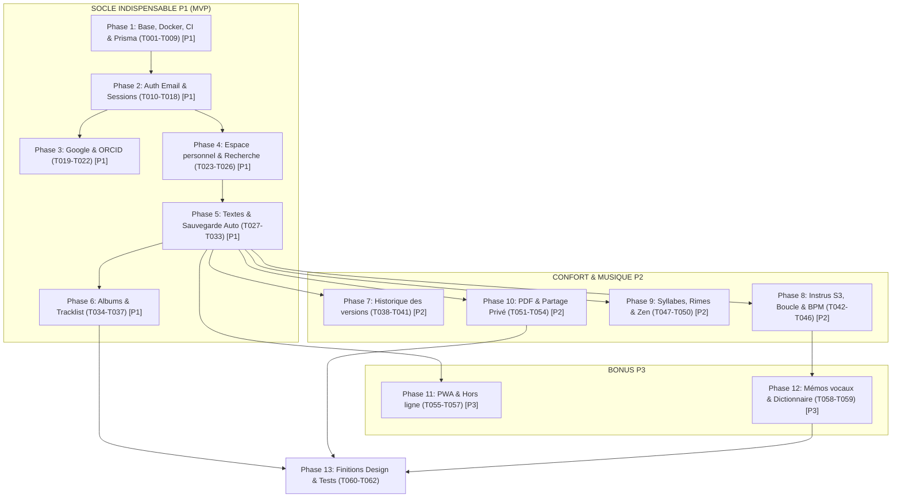

# Tasks: Verso Core Platform

**Branch**: `dev` | **Spec**: [specs/001-verso-core/spec.md](file:///home/normanxcat/Lab/verso/specs/001-verso-core/spec.md) | **Plan**: [specs/001-verso-core/plan.md](file:///home/normanxcat/Lab/verso/specs/001-verso-core/plan.md)

Ce document liste l'ensemble des tâches de développement ordonnancées par phase, découpées de sorte que chaque phase soit testable isolément. Chaque tâche indique sa priorité (**P1**, **P2**, **P3**) et le message de commit Conventional Commits associé à exécuter à son achèvement.

---

## Phase 1: Base du projet, Docker, CI, schéma Prisma (Priorité P1 - Socle)

**Objectif** : Initialiser le monorepo TypeScript (`apps/api`, `apps/web`, `packages/shared`), les conteneurs locaux (PostgreSQL 16, MinIO), la CI GitHub Actions et le schéma Prisma initial.
**Test indépendant** : Exécuter `docker compose up -d`, valider `pnpm install`, générer la migration Prisma `pnpm --filter @verso/api exec prisma migrate dev` et exécuter le check de typage `pnpm typecheck`.

- [X] T001 [P1] Initialiser la structure racine du monorepo pnpm avec `package.json`, `pnpm-workspace.yaml` et `.npmrc`. *Commit: `chore: initialisation de la racine du monorepo pnpm`*
- [X] T002 [P] [P1] Configurer les services locaux dans `docker-compose.yml` (PostgreSQL 16, MinIO S3 avec initialisation du bucket `verso-audio`). *Commit: `chore: configuration docker compose pour postgresql et minio`*
- [X] T003 [P] [P1] Configurer le pipeline CI dans `.github/workflows/ci.yml` (lint, typecheck, tests unitaires et intégration). *Commit: `ci: configuration du workflow github actions`*
- [ ] T004 [P] [P1] Mettre en place l'outillage de qualité racine dans `eslint.config.js`, `.prettierrc` et `tsconfig.base.json` avec politique zéro warning. *Commit: `chore: configuration eslint et prettier zero warning`*
- [ ] T005 [P1] Configurer le package de logique partagée dans `packages/shared/package.json` et `packages/shared/tsconfig.json`. *Commit: `chore: initialisation du package shared`*
- [ ] T006 [P1] Initialiser l'application backend Fastify dans `apps/api/package.json`, `apps/api/tsconfig.json` et `apps/api/src/server.ts`. *Commit: `chore: initialisation du backend fastify`*
- [ ] T007 [P1] Initialiser l'application frontend React avec Vite et Tailwind CSS dans `apps/web/package.json`, `apps/web/vite.config.ts`, `apps/web/tailwind.config.js` et `apps/web/src/main.tsx`. *Commit: `chore: initialisation du frontend react avec vite et tailwind`*
- [ ] T008 [P1] Définir le schéma Prisma complet (User, Account, Session, EmailToken, Album, Song, SongVersion, Tag, SongTag, Instrumental, ShareLink, VoiceNote) dans `apps/api/prisma/schema.prisma` et appliquer la migration initiale. *Commit: `feat: schéma prisma et migration initiale postgresql`*
- [ ] T009 [P1] Mettre en place le chargeur et validateur Zod des variables d'environnement dans `apps/api/src/config/env.ts` et mettre à jour `.env.example`. *Commit: `feat: validation zod des variables d environnement api`*

---

## Phase 2: Authentification email et sessions (Priorité P1 - Socle / US1)

**Objectif** : Mettre en place l'inscription avec mot de passe Argon2id, les sessions en base avec cookies `HttpOnly`, l'envoi de lien de vérification par email, et la bannière d'avertissement persistante.
**Test indépendant** : Inscrire un utilisateur, vérifier la réception du cookie de session, vérifier l'accès immédiat avec bannière d'avertissement, valider l'email via le lien, et tester la déconnexion / reconnexion.

- [ ] T010 [P] [US1] [P1] Définir les schémas de validation Zod d'authentification (`registerSchema`, `loginSchema`, `resetPasswordSchema`) dans `packages/shared/src/schemas/auth.ts`. *Commit: `feat: schémas zod d authentification`*
- [ ] T011 [P] [US1] [P1] Écrire la suite de tests d'intégration pour l'authentification et les sessions dans `apps/api/tests/integration/auth.test.ts`. *Commit: `test: tests d intégration pour l authentification email et sessions`*
- [ ] T012 [US1] [P1] Implémenter le service de hachage Argon2id et de génération/hachage des tokens d'email dans `apps/api/src/modules/auth/password.service.ts`. *Commit: `feat: service de hachage argon2id et tokens email`*
- [ ] T013 [US1] [P1] Implémenter le service de gestion des sessions en base PostgreSQL avec émission de cookies `HttpOnly/Secure/SameSite=Lax` dans `apps/api/src/modules/auth/session.service.ts`. *Commit: `feat: gestionnaire de sessions en base postgresql avec cookies httponly`*
- [ ] T014 [US1] [P1] Implémenter le service d'envoi d'emails transactionnels (Resend en prod / SMTP en local) dans `apps/api/src/modules/auth/email.service.ts`. *Commit: `feat: service d envoi d emails pour vérification et reset mot de passe`*
- [ ] T015 [US1] [P1] Enregistrer le plugin Fastify de rate limiting et les routes d'API d'authentification (`/register`, `/login`, `/logout`, `/verify-email`, `/forgot-password`, `/reset-password`, `/sessions`) dans `apps/api/src/modules/auth/auth.routes.ts`. *Commit: `feat: routes d api d authentification et sessions`*
- [ ] T016 [P] [US1] [P1] Implémenter le client API typé et le hook d'état d'authentification dans `apps/web/src/lib/auth-client.ts` et `apps/web/src/hooks/useAuth.ts`. *Commit: `feat: client et hook d authentification frontend`*
- [ ] T017 [US1] [P1] Créer les formulaires d'inscription, connexion, réinitialisation de mot de passe et vue des sessions actives dans `apps/web/src/pages/auth/`. *Commit: `feat: interfaces d inscription connexion et gestion des sessions`*
- [ ] T018 [US1] [P1] Implémenter la bannière d'avertissement persistante de vérification d'email dans `apps/web/src/components/common/EmailVerificationBanner.tsx`. *Commit: `feat: bannière persistante de rappel de vérification d email`*

---

## Phase 3: Google et ORCID (Priorité P1 - Socle / US1)

**Objectif** : Intégrer les flux OAuth avec PKCE et state pour Google et ORCID, avec exigence de confirmation par mot de passe si un compte email existe déjà.
**Test indépendant** : Simuler la connexion Google/ORCID, vérifier la création de compte ou l'affichage de la modale de confirmation par mot de passe si le compte existe déjà.

- [ ] T019 [P] [US1] [P1] Implémenter le service OAuth avec Arctic (PKCE, state, Google & ORCID) dans `apps/api/src/modules/auth/oauth.service.ts`. *Commit: `feat: service oauth avec arctic google et orcid sous pkce`*
- [ ] T020 [P] [US1] [P1] Écrire les tests d'intégration des flux OAuth et de confirmation de liaison dans `apps/api/tests/integration/oauth.test.ts`. *Commit: `test: tests d intégration oauth et liaison sécurisée`*
- [ ] T021 [US1] [P1] Implémenter les routes `/api/auth/oauth/:provider`, `/callback` et `/link-confirm` dans `apps/api/src/modules/auth/oauth.routes.ts`. *Commit: `feat: routes oauth et confirmation de liaison par mot de passe`*
- [ ] T022 [US1] [P1] Développer les boutons OAuth et la modale de saisie de mot de passe pour liaison de compte dans `apps/web/src/components/auth/OAuthButtons.tsx` et `apps/web/src/components/auth/LinkAccountModal.tsx`. *Commit: `feat: composants frontend oauth et modale de liaison de compte`*

---

## Phase 4: Espace personnel, recherche, filtres (Priorité P1 - Socle / US1 & US3)

**Objectif** : Afficher la liste des textes, albums et brouillons de l'utilisateur avec moteur de recherche plein texte et filtres combinables.
**Test indépendant** : Créer plusieurs textes avec différents statuts et mots-clés, vérifier le retour instantané (< 200 ms) lors de la recherche dans les titres et les paroles.

- [ ] T023 [P] [US3] [P1] Définir les schémas Zod de filtrage et recherche dans `packages/shared/src/schemas/search.ts`. *Commit: `feat: schémas zod pour la recherche et les filtres`*
- [ ] T024 [P] [US3] [P1] Écrire les tests d'intégration de recherche et filtrage dans `apps/api/tests/integration/search.test.ts`. *Commit: `test: tests d intégration de recherche plein texte et filtres`*
- [ ] T025 [US3] [P1] Implémenter les requêtes Prisma de recherche plein texte (`OR` sur titre et paroles) et de filtres combinables dans `apps/api/src/modules/songs/songs.repository.ts`. *Commit: `feat: moteur de recherche plein texte et filtres prisma`*
- [ ] T026 [US3] [P1] Implémenter la vue du tableau de bord avec barre de recherche en direct et filtres dans `apps/web/src/pages/DashboardPage.tsx` et `apps/web/src/components/dashboard/FilterBar.tsx`. *Commit: `feat: tableau de bord avec recherche temps réel et barre de filtres`*

---

## Phase 5: Textes, brouillons, sauvegarde auto, favoris, tags (Priorité P1 - Socle / US2)

**Objectif** : Offrir l'éditeur de texte épuré avec sauvegarde automatique continue (< 500 ms), compteurs en direct de mots et de lignes, marquage favori et gestion des tags.
**Test indépendant** : Rédiger des couplets dans l'éditeur, observer la sauvegarde sans bouton, couper le réseau, reprendre la frappe et constater la persistance locale et la restauration.

- [ ] T027 [P] [US2] [P1] Définir les schémas Zod CRUD pour les textes, tags et statuts dans `packages/shared/src/schemas/song.ts` et `packages/shared/src/schemas/tag.ts`. *Commit: `feat: schémas zod pour les textes et les tags`*
- [ ] T028 [P] [US2] [P1] Écrire les tests d'intégration CRUD textes et sauvegarde continue dans `apps/api/tests/integration/songs.test.ts`. *Commit: `test: tests d intégration crud textes et sauvegarde`*
- [ ] T029 [US2] [P1] Implémenter les routes et services CRUD textes (`GET`, `POST`, `PATCH`, `DELETE`) dans `apps/api/src/modules/songs/songs.service.ts` et `apps/api/src/modules/songs/songs.routes.ts`. *Commit: `feat: services et routes crud textes avec tags et favoris`*
- [ ] T030 [US2] [P1] Intégrer l'éditeur CodeMirror 6 minimaliste dans `apps/web/src/components/editor/LyricEditor.tsx`. *Commit: `feat: éditeur de texte codemirror 6 sobre et réactif`*
- [ ] T031 [US2] [P1] Implémenter le hook de sauvegarde automatique continue (< 500 ms) avec debounce et statut visuel discret dans `apps/web/src/hooks/useAutoSave.ts` et `apps/web/src/components/editor/SaveStatusIndicator.tsx`. *Commit: `feat: hook de sauvegarde automatique continue avec indicateur visuel`*
- [ ] T032 [US2] [P1] Implémenter les compteurs en temps réel de mots et de lignes dans `apps/web/src/components/editor/EditorMetricsBar.tsx`. *Commit: `feat: barre de métriques en direct avec compteurs de mots et de lignes`*
- [ ] T033 [US2] [P1] Implémenter le sélecteur de statut (Brouillon / Terminé), le bouton favori et la gestion des tags dans `apps/web/src/components/editor/SongMetadataSidebar.tsx`. *Commit: `feat: gestion des tags et statut brouillon ou terminé`*

---

## Phase 6: Albums et réorganisation (Priorité P1 - Socle / US3)

**Objectif** : Permettre la création d'albums, l'association de textes et le réordonnancement par glisser-déposer, avec garantie de détachement (zéro suppression) lors de la suppression de l'album.
**Test indépendant** : Créer un album, lui associer 3 morceaux, réordonner par glisser-déposer, vérifier la persistance de l'ordre, puis supprimer l'album et vérifier que les textes restent intacts.

- [ ] T034 [P] [US3] [P1] Définir les schémas Zod pour les albums et le réordonnancement de tracklist dans `packages/shared/src/schemas/album.ts`. *Commit: `feat: schémas zod pour les albums et la tracklist`*
- [ ] T035 [P] [US3] [P1] Écrire les tests d'intégration pour les albums et la réorganisation dans `apps/api/tests/integration/albums.test.ts`. *Commit: `test: tests d intégration albums réordonnancement et détachement`*
- [ ] T036 [US3] [P1] Implémenter les services et routes `/api/albums`, `/reorder` et `/tracks` avec détachement automatique à la suppression dans `apps/api/src/modules/albums/albums.service.ts` et `apps/api/src/modules/albums/albums.routes.ts`. *Commit: `feat: api albums avec réordonnancement et détachement automatique`*
- [ ] T037 [US3] [P1] Développer la vue d'album et la tracklist triable par glisser-déposer avec `@dnd-kit` dans `apps/web/src/pages/AlbumDetailPage.tsx` et `apps/web/src/components/album/SortableTracklist.tsx`. *Commit: `feat: interface album avec réorganisation de tracklist par glisser-déposer`*

---

## Phase 7: Historique des versions (Priorité P2 - Confort / US5)

**Objectif** : Enregistrer un historique horodaté immuable des versions d'un texte, conservé indéfiniment sans purge, avec aperçu et restauration sans écrasement.
**Test indépendant** : Modifier un texte, vérifier l'apparition des versions horodatées, prévisualiser une ancienne révision et la restaurer avec succès.

- [ ] T038 [P] [US5] [P2] Définir les schémas Zod pour la consultation et restauration de versions dans `packages/shared/src/schemas/version.ts`. *Commit: `feat: schémas zod pour l historique des versions`*
- [ ] T039 [P] [US5] [P2] Écrire les tests d'archivage permanent et restauration de version dans `apps/api/tests/integration/versions.test.ts`. *Commit: `test: tests d intégration de l historique et de la restauration de versions`*
- [ ] T040 [US5] [P2] Implémenter le service d'archivage automatique immuable sans plafond et la restauration dans `apps/api/src/modules/songs/versions.service.ts` et `apps/api/src/modules/songs/versions.routes.ts`. *Commit: `feat: service d archivage immuable et restauration de versions`*
- [ ] T041 [US5] [P2] Implémenter le tiroir latéral d'historique des versions avec prévisualisation et action de restauration dans `apps/web/src/components/editor/VersionHistoryDrawer.tsx`. *Commit: `feat: panneau d historique des versions avec aperçu et restauration`*

---

## Phase 8: Instrus, lecteur, BPM, boucle, métronome (Priorité P2 - Musique / US4)

**Objectif** : Permettre le téléversement direct sur compatible S3 (URLs présignées, $\le 75$ Mo, MP3/WAV, max 3 pistes), l'écoute en cours d'écriture, le réglage BPM/tonalité, la boucle de section et le métronome.
**Test indépendant** : Téléverser un fichier WAV de 40 Mo via URL signée, définir une boucle de 15s à 45s, lancer la lecture et vérifier la fluidité de la frappe et le clic du métronome.

- [ ] T042 [P] [US4] [P2] Configurer le plugin Fastify S3 avec génération d'URLs présignées PUT et GET dans `apps/api/src/plugins/s3.plugin.ts`. *Commit: `feat: plugin fastify s3 pour urls présignées de téléversement et lecture`*
- [ ] T043 [P] [US4] [P2] Définir les schémas Zod pour les instrumentales (validation $\le 75$ Mo, formats MP3/WAV, max 3 pistes) dans `packages/shared/src/schemas/audio.ts`. *Commit: `feat: schémas zod pour les instrumentales et quotas audio`*
- [ ] T044 [US4] [P2] Écrire les tests d'intégration pour les routes audio et validation de quotas dans `apps/api/tests/integration/audio.test.ts`. *Commit: `test: tests d intégration du cycle de vie des instrumentales s3`*
- [ ] T045 [US4] [P2] Implémenter les routes d'upload-url, confirmation, sélection de piste active et suppression dans `apps/api/src/modules/audio/audio.routes.ts`. *Commit: `feat: routes api pour la gestion des instrumentales audio`*
- [ ] T046 [US4] [P2] Implémenter le lecteur audio Web Audio API avec sélection de boucle et métronome synchronisé dans `apps/web/src/components/audio/AudioPlayerBar.tsx` et `apps/web/src/hooks/useAudioPlayer.ts`. *Commit: `feat: lecteur audio intégré avec boucle de section et métronome web audio`*

---

## Phase 9: Aides à l'écriture : syllabes, rimes, mode concentration (Priorité P2 - Confort / US5)

**Objectif** : Fournir l'analyse métrique des syllabes poétiques en marge de chaque ligne, la détection et coloration des rimes en français, et le mode plein écran zen sans distraction.
**Test indépendant** : Taper un quatrain en alexandrins avec rimes croisées A-B-A-B, vérifier que le gutter affiche 12 syllabes et que les rimes sont surlignées avec deux teintes distinctes.

- [ ] T047 [P] [US5] [P2] Développer l'algorithme de calcul des syllabes françaises poétiques dans `packages/shared/src/lyrics-engine/syllables.ts` et ses tests dans `packages/shared/tests/syllables.test.ts`. *Commit: `feat: algorithme de comptage des syllabes poétiques françaises`*
- [ ] T048 [P] [US5] [P2] Développer l'algorithme de détection phonétique et regroupement des rimes françaises dans `packages/shared/src/lyrics-engine/rhymes.ts` et ses tests dans `packages/shared/tests/rhymes.test.ts`. *Commit: `feat: moteur de détection phonétique et coloration des rimes`*
- [ ] T049 [US5] [P2] Créer les extensions CodeMirror 6 pour la marge de syllabes et le surlignage de rimes dans `apps/web/src/components/editor/extensions/syllablesGutter.ts` et `apps/web/src/components/editor/extensions/rhymeHighlighter.ts`. *Commit: `feat: extensions codemirror 6 pour gouttière de syllabes et surlignage de rimes`*
- [ ] T050 [US5] [P2] Implémenter le basculement en mode concentration zen plein écran dans `apps/web/src/components/editor/ZenModeToggle.tsx`. *Commit: `feat: mode concentration plein écran sans distraction`*

---

## Phase 10: Export PDF et liens de partage privés (Priorité P2 - Preuve & Partage / US6)

**Objectif** : Générer côté serveur un export PDF élégant horodaté servant de certificat d'antériorité, et créer des liens privés en lecture seule révocables avec expiration optionnelle et rate limiting.
**Test indépendant** : Exporter un texte en PDF et vérifier son contenu/horodatage, puis générer un lien privé, l'ouvrir dans une fenêtre incognito, vérifier l'absence d'options de modification et tester la révocation immédiate.

- [ ] T051 [P] [US6] [P2] Implémenter le générateur de PDF d'antériorité côté serveur avec `pdfkit` dans `apps/api/src/modules/songs/pdf.service.ts` et route `/export/pdf`. *Commit: `feat: générateur pdf côté serveur avec horodatage d antériorité`*
- [ ] T052 [P] [US6] [P2] Définir les schémas Zod et tests pour les liens de partage privés dans `packages/shared/src/schemas/share.ts` et `apps/api/tests/integration/shares.test.ts`. *Commit: `feat: schémas zod et tests pour les liens de partage privés`*
- [ ] T053 [US6] [P2] Implémenter les routes de création, révocation et consultation publique en lecture seule sous rate limiting dans `apps/api/src/modules/songs/shares.routes.ts`. *Commit: `feat: routes d api de partage privé révocable en lecture seule`*
- [ ] T054 [US6] [P2] Créer la modale de partage avec gestion d'expiration dans `apps/web/src/components/editor/ShareModal.tsx` et la page de consultation publique dans `apps/web/src/pages/PublicSharePage.tsx`. *Commit: `feat: interface de partage privé et page de lecture anonyme sobre`*

---

## Phase 11: PWA et hors ligne (Priorité P3 - Mobilité / US7)

**Objectif** : Rendre l'application installable sur smartphone via PWA, permettre la rédaction totale hors ligne (IndexedDB) et assurer la synchronisation au retour du réseau avec création d'un brouillon de copie en cas de conflit.
**Test indépendant** : Passer en mode hors ligne, rédiger un nouveau couplet, modifier concurremment le texte sur un autre appareil, rétablir la connexion et vérifier que la version hors ligne est dupliquée en `[Titre] (copie hors ligne)` sans écrasement.

- [ ] T055 [P] [US7] [P3] Configurer `vite-plugin-pwa` avec Service Worker, manifest web et stratégie de cache dans `apps/web/vite.config.ts` et `apps/web/public/manifest.json`. *Commit: `feat: configuration pwa avec service worker et manifest`*
- [ ] T056 [US7] [P3] Développer la couche de stockage IndexedDB avec `idb` pour la persistance locale des textes et la file d'attente d'actions dans `apps/web/src/lib/offline-storage.ts`. *Commit: `feat: persistance locale indexeddb pour la rédaction hors ligne`*
- [ ] T057 [US7] [P3] Implémenter le hook de synchronisation réseau avec résolution de conflit par duplication en brouillon dans `apps/web/src/hooks/useOfflineSync.ts`. *Commit: `feat: synchronisation automatique hors ligne avec duplication de conflit`*

---

## Phase 12: Bonus : enregistrement vocal, suggestions de rimes (Priorité P3 - Bonus / US7)

**Objectif** : Permettre l'enregistrement vocal d'un freestyle rapide (`MediaRecorder`) associé au texte et intégrer un panneau de suggestions de rimes avec dictionnaire français.
**Test indépendant** : Enregistrer un mémo vocal de 10s via le micro, vérifier son attachement au texte, puis sélectionner un mot et visualiser les suggestions de rimes riches et suffisantes.

- [ ] T058 [P] [US7] [P3] Implémenter l'enregistreur vocal `MediaRecorder` dans `apps/web/src/components/audio/VoiceRecorder.tsx` et les routes d'upload associées dans `apps/api/src/modules/audio/voice-notes.routes.ts`. *Commit: `feat: enregistrement et attachement de mémos vocaux freestyle`*
- [ ] T059 [P] [US7] [P3] Intégrer la base lexicale de rimes françaises dans `packages/shared/src/lyrics-engine/rhyme-dict.ts` et le tiroir de suggestions dans `apps/web/src/components/editor/RhymeSuggestionsDrawer.tsx`. *Commit: `feat: panneau latéral de suggestions de rimes avec dictionnaire français`*

---

## Phase 13: Finitions design et tests (Priorité P1/P2/P3 - Polissage Global)

**Objectif** : Appliquer les règles esthétiques du skill `frontend-design` (contrastes, typographie soignée, bascule dark/light mode), exécuter la validation de bout en bout et durcir la sécurité.
**Test indépendant** : Exécuter avec succès la suite complète `pnpm test`, `pnpm typecheck`, `pnpm lint` (0 erreur, 0 warning) et valider l'ensemble des scénarios de `quickstart.md`.

- [ ] T060 [P] [P1] Harmoniser l'interface selon le skill `frontend-design` (contrastes accessibles, typographie, espacements généreux, bascule dark/light fluide) dans `apps/web/src/index.css` et `apps/web/src/components/common/ThemeToggle.tsx`. *Commit: `style: harmonisation esthétique minimaliste dark light mode selon frontend design`*
- [ ] T061 [P1] Exécuter la suite complète de validation end-to-end `quickstart.md` et les tests automatisés du monorepo (`pnpm test`, `pnpm typecheck`, `pnpm lint`). *Commit: `test: validation complète de la suite de tests et des scénarios quickstart`*
- [ ] T062 [P1] Réaliser l'audit final de sécurité : vérification des en-têtes Helmet, CORS, protection CSRF, isolation multi-tenante et absence de secrets. *Commit: `security: vérification et durcissement des protections et en-têtes`*

---

## Graphe de Dépendances & Ordre d'Exécution

---

## Stratégie d'Implémentation & Règles de Commit

1. **Jalon MVP (Fin de Phase 6)** : Le socle P1 complet (Auth, Espace personnel, Textes avec sauvegarde continue, Albums) constitue le produit minimum viable fonctionnel.
2. **Transition stricte P1 $\rightarrow$ P2 $\rightarrow$ P3** : Interdiction formelle de démarrer les phases P2 (Phases 7 à 10) tant que le socle P1 n'est pas 100% stable, testé et validé.
3. **Commit systématique** : Chaque tâche terminée doit faire l'objet de `git add` et d'un commit Conventional Commits en français avec le message spécifié, sans aucun `.env` ni secret.
