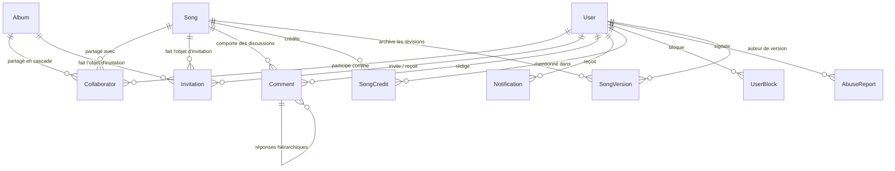

# Data Model: Collaboration entre Auteurs

Ce document définit les extensions relationnelles Prisma / PostgreSQL pour la gestion de la collaboration, des invitations, des commentaires ancrés, des notifications, des crédits artistiques et de la modération, conformément à la [Constitution v2.0.0](file:///home/normanxcat/Lab/verso/.specify/memory/constitution.md).

---

## 1. Vue d'Ensemble des Entités



---

## 2. Modèles Détaillés Prisma

### 2.1 Énumérations

```prisma
enum CollaboratorRole {
  CO_AUTHOR
  COMMENTER
  READER
}

enum CollaboratorStatus {
  ACTIVE
  REVOKED
  LEFT
}

enum InvitationStatus {
  PENDING
  ACCEPTED
  DECLINED
  REVOKED
  EXPIRED
}

enum NotificationType {
  INVITATION_RECEIVED
  INVITATION_ACCEPTED
  INVITATION_DECLINED
  COMMENT_ADDED
  COMMENT_REPLY
  MENTION
  CONFLICT_DETECTED
}

enum CreditRole {
  AUTHOR
  FEATURING
  PRODUCER
  COMPOSER
}

enum ReportReason {
  HARASSMENT
  SPAM
  INAPPROPRIATE_CONTENT
  COPYRIGHT_INFRINGEMENT
  OTHER
}

enum ReportStatus {
  PENDING
  REVIEWED
  DISMISSED
  RESOLVED
}
```

---

### 2.2 Entité `Collaborator`

Définit un droit d'accès persistant d'un utilisateur à un texte ou un album.

```prisma
model Collaborator {
  id           String             @id @default(cuid())
  role         CollaboratorRole
  status       CollaboratorStatus @default(ACTIVE)

  // Utilisateur collaborateur
  userId       String             @map("user_id")
  user         User               @relation(fields: [userId], references: [id], onDelete: Cascade)

  // Ressource cible (texte OU album exclusif)
  songId       String?            @map("song_id")
  song         Song?              @relation(fields: [songId], references: [id], onDelete: Cascade)
  albumId      String?            @map("album_id")
  album        Album?             @relation(fields: [albumId], references: [id], onDelete: Cascade)

  // Traçabilité de l'invitation
  invitedById  String             @map("invited_by_id")
  invitedBy    User               @relation("InvitedCollaborators", fields: [invitedById], references: [id], onDelete: Restrict)

  createdAt    DateTime           @default(now()) @map("created_at")
  updatedAt    DateTime           @updatedAt @map("updated_at")

  @@unique([userId, songId], name: "unique_user_song_collaborator")
  @@unique([userId, albumId], name: "unique_user_album_collaborator")
  @@index([userId, status])
  @@index([songId, status])
  @@index([albumId, status])
  @@map("collaborators")
}
```

---

### 2.3 Entité `Invitation`

Gère le cycle de vie des offres de collaboration transmises par email ou pseudonyme.

```prisma
model Invitation {
  id           String           @id @default(cuid())
  tokenHash    String           @unique @map("token_hash") // SHA-256 du token aléatoire sec_
  role         CollaboratorRole
  status       InvitationStatus @default(PENDING)

  // Destinataire : par email ou par utilisateur connu
  invitedEmail String?          @map("invited_email")
  invitedUserId String?         @map("invited_user_id")
  invitedUser  User?            @relation("ReceivedInvitations", fields: [invitedUserId], references: [id], onDelete: SetNull)

  // Auteur de l'invitation
  inviterId    String           @map("inviter_id")
  inviter      User             @relation("SentInvitations", fields: [inviterId], references: [id], onDelete: Cascade)

  // Ressource cible
  songId       String?          @map("song_id")
  song         Song?            @relation(fields: [songId], references: [id], onDelete: Cascade)
  albumId      String?          @map("album_id")
  album        Album?           @relation(fields: [albumId], references: [id], onDelete: Cascade)

  expiresAt    DateTime         @map("expires_at") // Défaut : now() + 7 jours
  acceptedAt   DateTime?        @map("accepted_at")

  createdAt    DateTime         @default(now()) @map("created_at")
  updatedAt    DateTime         @updatedAt @map("updated_at")

  @@index([tokenHash])
  @@index([invitedUserId, status])
  @@index([invitedEmail, status])
  @@index([songId, status])
  @@index([expiresAt])
  @@map("invitations")
}
```

---

### 2.4 Entité `Comment`

Commentaire ou annotation ancré à une plage de lignes sur un texte partagé.

```prisma
model Comment {
  id           String       @id @default(cuid())
  content      String       // Texte assaini, max 2000 caractères
  startLine    Int          @map("start_line") // Ligne de début (1-indexed)
  endLine      Int          @map("end_line")   // Ligne de fin (1-indexed)

  songId       String       @map("song_id")
  song         Song         @relation(fields: [songId], references: [id], onDelete: Cascade)

  authorId     String       @map("author_id")
  author       User         @relation(fields: [authorId], references: [id], onDelete: Cascade)

  // Hiérarchie de réponses
  parentId     String?      @map("parent_id")
  parent       Comment?     @relation("CommentReplies", fields: [parentId], references: [id], onDelete: Cascade)
  replies      Comment[]    @relation("CommentReplies")

  // Résolution
  isResolved   Boolean      @default(false) @map("is_resolved")
  resolvedById String?      @map("resolved_by_id")
  resolvedBy   User?        @relation("ResolvedComments", fields: [resolvedById], references: [id], onDelete: SetNull)
  resolvedAt   DateTime?    @map("resolved_at")

  // Anonymisation post-départ d'un collaborateur
  isAnonymized Boolean      @default(false) @map("is_anonymized")

  createdAt    DateTime     @default(now()) @map("created_at")
  updatedAt    DateTime     @updatedAt @map("updated_at")

  @@index([songId, isResolved])
  @@index([parentId])
  @@index([authorId])
  @@map("comments")
}
```

---

### 2.5 Entité `Notification`

File d'alertes in-app et base des emails transactionnels groupés.

```prisma
model Notification {
  id           String           @id @default(cuid())
  type         NotificationType
  isRead       Boolean          @default(false) @map("is_read")

  recipientId  String           @map("recipient_id")
  recipient    User             @relation("UserNotifications", fields: [recipientId], references: [id], onDelete: Cascade)

  actorId      String?          @map("actor_id")
  actor        User?            @relation("ActorNotifications", fields: [actorId], references: [id], onDelete: SetNull)

  // Références contextuelles
  songId       String?          @map("song_id")
  albumId      String?          @map("album_id")
  commentId    String?          @map("comment_id")
  invitationId String?          @map("invitation_id")

  createdAt    DateTime         @default(now()) @map("created_at")

  @@index([recipientId, isRead, createdAt])
  @@map("notifications")
}
```

---

### 2.6 Entité `SongCredit`

Déclaration officielle des crédits artistiques figurant sur l'export PDF.

```prisma
model SongCredit {
  id         String     @id @default(cuid())
  name       String     // Nom ou blaze d'artiste affiché
  role       CreditRole
  percentage Float?     // Quote-part optionnelle (0 à 100)
  order      Int        @default(0) // Ordre d'affichage dans le cartouche

  songId     String     @map("song_id")
  song       Song       @relation(fields: [songId], references: [id], onDelete: Cascade)

  // Rattachement optionnel à un compte Verso
  userId     String?    @map("user_id")
  user       User?      @relation(fields: [userId], references: [id], onDelete: SetNull)

  createdAt  DateTime   @default(now()) @map("created_at")
  updatedAt  DateTime   @updatedAt @map("updated_at")

  @@index([songId, order])
  @@map("song_credits")
}
```

---

### 2.7 Entités de Modération : `UserBlock` & `AbuseReport`

```prisma
model UserBlock {
  id        String   @id @default(cuid())
  blockerId String   @map("blocker_id")
  blocker   User     @relation("BlockingUsers", fields: [blockerId], references: [id], onDelete: Cascade)

  blockedId String   @map("blocked_id")
  blocked   User     @relation("BlockedUsers", fields: [blockedId], references: [id], onDelete: Cascade)

  createdAt DateTime @default(now()) @map("created_at")

  @@unique([blockerId, blockedId], name: "unique_user_block")
  @@index([blockerId])
  @@index([blockedId])
  @@map("user_blocks")
}

model AbuseReport {
  id             String       @id @default(cuid())
  reason         ReportReason
  details        String?      @db.Text
  status         ReportStatus @default(PENDING)

  reporterId     String       @map("reporter_id")
  reporter       User         @relation("ReportedAbuses", fields: [reporterId], references: [id], onDelete: Cascade)

  reportedUserId String?      @map("reported_user_id")
  reportedUser   User?        @relation("AccusedAbuses", fields: [reportedUserId], references: [id], onDelete: SetNull)

  songId         String?      @map("song_id")
  commentId      String?      @map("comment_id")

  createdAt      DateTime     @default(now()) @map("created_at")
  updatedAt      DateTime     @updatedAt @map("updated_at")

  @@index([status, createdAt])
  @@map("abuse_reports")
}
```

---

### 2.8 Évolutions des Modèles Existants

#### Modèle `Song`
- Ajout du champ de verrouillage optimiste :
  ```prisma
  revision Int @default(1)
  ```
- Relations ajoutées : `collaborators`, `invitations`, `comments`, `credits`.

#### Modèle `SongVersion`
- Ajout de l'attribution d'auteur et du flag de conflit :
  ```prisma
  authorId   String?  @map("author_id")
  author     User?    @relation(fields: [authorId], references: [id], onDelete: SetNull)
  isConflict Boolean  @default(false) @map("is_conflict")
  ```

#### Modèle `User`
- Profil public minimal (anti-fuite d'email) :
  ```prisma
  displayName String? @map("display_name")
  avatarUrl   String? @map("avatar_url")
  bio         String? @db.VarChar(280)
  ```
- Relations inverses avec `collaborators`, `invitations`, `comments`, `notifications`, `blocks`, `reports`.
