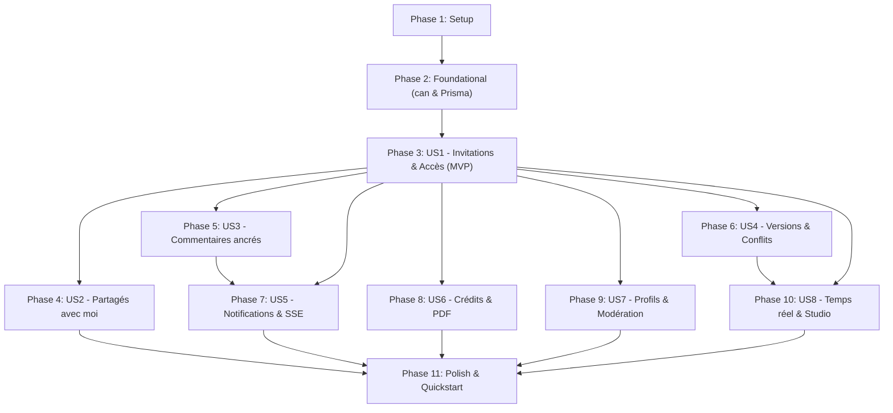

# Tasks: Collaboration entre Auteurs (Author Collaboration)

**Branch**: `dev` | **Spec**: [specs/002-author-collaboration/spec.md](file:///home/normanxcat/Lab/verso/specs/002-author-collaboration/spec.md) | **Plan**: [specs/002-author-collaboration/plan.md](file:///home/normanxcat/Lab/verso/specs/002-author-collaboration/plan.md)

Ce document liste l'ensemble des tâches de développement ordonnancées par phase, découpées de sorte que chaque phase soit testable isolément et traçable par récit utilisateur ([US1] à [US8]). Les contraintes du modèle de données et les règles constitutionnelles sont citées textuellement pour guider l'implémentation sans ambiguïté.

---

## Phase 1: Setup (Shared Infrastructure)

**Purpose**: Initialisation des dépendances et définition des schémas / types partagés pour la collaboration.

- [ ] T001 Installer les dépendances backend et frontend de collaboration (`@fastify/websocket`, `yjs`) dans `apps/api/package.json` et (`yjs`, `@y-rb/y-codemirror`) dans `apps/web/package.json`
- [ ] T002 [P] Définir les énumérations et interfaces TypeScript de collaboration dans `packages/shared/src/types/collaboration.ts` (`CollaboratorRole` ['CO_AUTHOR', 'COMMENTER', 'READER'], `CollaboratorStatus` ['ACTIVE', 'REVOKED', 'LEFT'], `InvitationStatus` ['PENDING', 'ACCEPTED', 'DECLINED', 'REVOKED', 'EXPIRED'], `NotificationType`, `CreditRole`, `ReportReason`, `ReportStatus`)
- [ ] T003 [P] Créer les schémas Zod pour la collaboration et les invitations dans `packages/shared/src/schemas/collaboration.ts` (avec les contraintes textuelles `role CollaboratorRole`, `expiresInDays Int default 7`, quota strict de 10 collaborateurs actifs simultanés par texte)
- [ ] T004 [P] Créer les schémas Zod pour les commentaires dans `packages/shared/src/schemas/comment.ts` (avec les contraintes textuelles `content String` max 2000 caractères, `startLine Int` 1-indexed, `endLine Int` 1-indexed)
- [ ] T005 [P] Créer les schémas Zod pour les crédits artistiques dans `packages/shared/src/schemas/credit.ts` (avec les contraintes textuelles `name String`, `role CreditRole`, `percentage Float?` quote-part optionnelle de 0 à 100)
- [ ] T006 [P] Créer les schémas Zod pour la modération et la recherche dans `packages/shared/src/schemas/moderation.ts` (avec les contraintes textuelles `bio String? @db.VarChar(280)`, `reason ReportReason`, `details String? @db.Text`, paramètre de recherche exacte `q`)
- [ ] T007 [P] Créer les schémas Zod pour les notifications et préférences dans `packages/shared/src/schemas/notification.ts` (énumération `NotificationType`, booléens de préférences email et in-app)
- [ ] T008 Exposer l'ensemble des schémas et types de collaboration dans le point d'entrée partagé `packages/shared/src/index.ts`

---

## Phase 2: Foundational (Blocking Prerequisites)

**Purpose**: Socle central d'autorisation `can()` et migration relationnelle Prisma indispensable avant tout développement de récit utilisateur.

**⚠️ CRITICAL**: Aucun récit utilisateur ne peut débuter tant que cette phase n'est pas validée.

- [ ] T009 Étendre le schéma Prisma dans `apps/api/prisma/schema.prisma` avec les modèles `Collaborator`, `Invitation`, `Comment`, `Notification`, `SongCredit`, `UserBlock`, `AbuseReport` et les évolutions de `Song` (`revision Int @default(1)`), `SongVersion` (`authorId String?`, `isConflict Boolean @default(false)`), et `User` (`bio String? @db.VarChar(280)`)
- [ ] T010 Générer le client Prisma et exécuter la migration de base de données dans `apps/api/prisma/migrations/`
- [ ] T011 [P] Définir les types d'actions, de cibles et de ressources d'autorisation dans `apps/api/src/modules/permissions/permissions.types.ts`
- [ ] T012 Implémenter le moteur d'autorisation central unique `can(user, resource, action)` dans `apps/api/src/modules/permissions/permissions.service.ts` évaluant la propriété, les rôles de collaborateurs et l'héritage d'album
- [ ] T013 [P] Écrire la suite de tests unitaires exhaustifs pour `can()` couvrant 100% de la matrice Rôle × Ressource × Action dans `apps/api/tests/unit/permissions.test.ts`
- [ ] T014 Implémenter le garde Fastify `requirePermission(action)` et l'intercepteur de sécurité garantissant une réponse HTTP 404 neutre en cas de refus d'accès dans `apps/api/src/modules/permissions/permissions.guard.ts`

**Checkpoint**: Socle d'autorisation et persistance relationnelle prêts — le développement des récits utilisateurs peut commencer.

---

## Phase 3: User Story 1 - Inviter des collaborateurs et gérer les accès aux œuvres (Priority: P1) 🎯 MVP

**Goal**: Permettre aux auteurs propriétaires d'inviter des co-auteurs, commentateurs ou lecteurs par nom d'utilisateur ou email avec tokens hachés, de consulter la liste des accès, de changer les rôles, de révoquer un accès et de quitter un projet.

**Independent Test**: Créer un texte, émettre une invitation par username ou email, vérifier le token haché et la validité de 7 jours, accepter l'invitation avec le second compte, vérifier l'accès co-auteur, changer le rôle en commentateur, et quitter le projet.

### Tests for User Story 1 ⚠️

- [ ] T015 [P] [US1] Écrire la suite de tests d'intégration pour le cycle d'invitation, le hachage SHA-256 de token, la mutation de rôle et la révocation dans `apps/api/tests/integration/collaboration.test.ts`

### Implementation for User Story 1

- [ ] T016 [P] [US1] Implémenter le repository de collaboration pour les entités `Collaborator` et `Invitation` dans `apps/api/src/modules/collaboration/collaboration.repository.ts`
- [ ] T017 [US1] Implémenter le service de collaboration dans `apps/api/src/modules/collaboration/collaboration.service.ts` (hachage SHA-256 du token aléatoire sec_, contrainte textuelle `expiresAt DateTime` à now() + 7 jours, quota strict de 10 collaborateurs actifs par texte, transfert automatique au co-auteur le plus ancien à la suppression du compte `FR-002a`, cascade de permissions sur album `FR-010`)
- [ ] T018 [US1] Implémenter les routes d'API Fastify de collaboration dans `apps/api/src/modules/collaboration/collaboration.routes.ts` (`POST/GET /api/songs/:id/invitations`, `GET/PATCH/DELETE /api/songs/:id/collaborators/:userId`, équivalents pour albums, acceptation/refus par token, et départ volontaire)
- [ ] T019 [US1] Enregistrer les routes de collaboration dans `apps/api/src/server.ts` avec rate limiting strict de 10 req/min sur l'envoi d'invitations
- [ ] T020 [P] [US1] Implémenter le client API de collaboration dans `apps/web/src/lib/collaboration-client.ts`
- [ ] T021 [P] [US1] Implémenter le formulaire d'invitation `InviteCollaboratorForm.tsx` avec sélecteur de rôle et saisie d'identifiant/email dans `apps/web/src/components/collaboration/InviteCollaboratorForm.tsx`
- [ ] T022 [US1] Implémenter la modale de gestion des accès `CollaboratorsModal.tsx` listant les membres actifs et en attente, le changement de rôle et la révocation dans `apps/web/src/components/collaboration/CollaboratorsModal.tsx`
- [ ] T023 [US1] Intégrer le déclencheur d'invitation et la modale d'accès dans l'en-tête de l'éditeur `apps/web/src/pages/EditorPage.tsx` et de la page album `apps/web/src/pages/AlbumDetailPage.tsx`

**Checkpoint**: User Story 1 fonctionnelle et testable isolément — MVP de collaboration opérationnel.

---

## Phase 4: User Story 2 - Consulter et filtrer les œuvres partagées (Priority: P1)

**Goal**: Offrir une vue dédiée "Partagés avec moi" dans l'espace personnel, avec filtres par rôle et par propriétaire, ainsi qu'une page de réception des invitations.

**Independent Test**: Se connecter avec un compte collaborateur, ouvrir la vue "Partagés avec moi", filtrer par rôle "Co-auteur", filtrer par propriétaire, constater que seules les œuvres correspondantes s'affichent, et vérifier qu'une œuvre révoquée renvoie 404 et disparaît de la vue.

### Tests for User Story 2 ⚠️

- [ ] T024 [P] [US2] Écrire la suite de tests d'intégration pour la requête des œuvres partagées et les filtres rôle/propriétaire dans `apps/api/tests/integration/shared-with-me.test.ts`

### Implementation for User Story 2

- [ ] T025 [US2] Implémenter les méthodes de recherche des textes et albums partagés avec filtres par rôle et propriétaire dans `apps/api/src/modules/collaboration/collaboration.repository.ts`
- [ ] T026 [US2] Implémenter la route d'API `GET /api/collaborations/shared-with-me` dans `apps/api/src/modules/collaboration/collaboration.routes.ts`
- [ ] T027 [P] [US2] Implémenter le badge visuel de statut collaboratif `SharedBadge.tsx` dans `apps/web/src/components/collaboration/SharedBadge.tsx`
- [ ] T028 [US2] Développer la page de consultation `SharedWithMePage.tsx` avec filtres par rôle et par propriétaire dans `apps/web/src/pages/SharedWithMePage.tsx`
- [ ] T029 [US2] Développer la page de gestion des invitations reçues `InvitationsPage.tsx` avec boutons Accepter / Refuser dans `apps/web/src/pages/InvitationsPage.tsx`
- [ ] T030 [US2] Ajouter les onglets "Partagés avec moi" et "Invitations" dans la navigation `apps/web/src/components/landing/Navbar.tsx` et le tableau de bord `apps/web/src/pages/DashboardPage.tsx`

**Checkpoint**: User Stories 1 et 2 fonctionnent indépendamment et de concert.

---

## Phase 5: User Story 3 - Échanger par commentaires contextualisés et mentions (Priority: P1)

**Goal**: Permettre aux auteurs, co-auteurs et commentateurs d'ancrer des commentaires sur des vers, d'échanger en fils hiérarchiques, de mentionner des collaborateurs par `@pseudonyme` et de marquer les points comme résolus/rouverts.

**Independent Test**: Sélectionner une ligne dans un texte partagé, publier un commentaire avec mention `@nom`, répondre depuis le compte mentionné, marquer le fil comme résolu pour vérifier son masquage de l'éditeur, le rouvrir, et vérifier l'anonymisation si le collaborateur quitte le projet (`FR-005a`).

### Tests for User Story 3 ⚠️

- [ ] T031 [P] [US3] Écrire la suite de tests d'intégration pour les commentaires ancrés, les fils de réponses, les mentions et la résolution dans `apps/api/tests/integration/comments.test.ts`

### Implementation for User Story 3

- [ ] T032 [P] [US3] Implémenter le repository des commentaires dans `apps/api/src/modules/comments/comments.repository.ts`
- [ ] T033 [US3] Implémenter le service de commentaires dans `apps/api/src/modules/comments/comments.service.ts` (avec les contraintes textuelles `content String` max 2000 caractères, assainissement anti-XSS strict, détection des mentions `@pseudonyme`, anonymisation `isAnonymized: true` lors du départ d'un collaborateur `FR-005a`)
- [ ] T034 [US3] Implémenter les routes d'API Fastify pour les commentaires dans `apps/api/src/modules/comments/comments.routes.ts` (`POST/GET /api/songs/:id/comments`, `POST /api/comments/:id/replies`, `PATCH /api/comments/:id/resolve`, `PATCH /api/comments/:id/reopen`) avec rate limiting de 20 req/min
- [ ] T035 [P] [US3] Implémenter le client API des commentaires dans `apps/web/src/lib/comments-client.ts`
- [ ] T036 [P] [US3] Implémenter le composant de saisie de commentaire `CommentComposer.tsx` avec auto-complétion des mentions `@` dans `apps/web/src/components/comments/CommentComposer.tsx`
- [ ] T037 [P] [US3] Implémenter l'extension CodeMirror 6 pour les marqueurs et gouttière de commentaires dans `apps/web/src/components/editor/extensions/commentMarkers.ts`
- [ ] T038 [US3] Implémenter le tiroir latéral des discussions `CommentThreadDrawer.tsx` avec affichage des fils, réponses et action de résolution dans `apps/web/src/components/comments/CommentThreadDrawer.tsx`
- [ ] T039 [US3] Intégrer l'extension de commentaires et le tiroir latéral dans `apps/web/src/components/editor/LyricEditor.tsx` et `apps/web/src/pages/EditorPage.tsx`

**Checkpoint**: Les commentaires ancrés et le système de relecture collaborative sont pleinement opérationnels.

---

## Phase 6: User Story 4 - Tracer les auteurs de chaque version et restaurer sans risque (Priority: P1)

**Goal**: Attribuer chaque version à son auteur réel, consigner qui restaure une révision, et gérer les conflits d'édition asynchrone par verrouillage optimiste sans aucune perte de texte.

**Independent Test**: Éditer un texte avec l'auteur A puis l'auteur B, vérifier les blazes dans l'historique des versions, simuler une modification concurrente avec un numéro de révision obsolète pour déclencher un rejet HTTP 409 et vérifier la création automatique d'une version étiquetée « Conflit » avec `authorId`.

### Tests for User Story 4 ⚠️

- [ ] T040 [P] [US4] Écrire la suite de tests d'intégration pour le verrouillage optimiste sur révision, la détection de conflit 409 et l'attribution nominative des versions dans `apps/api/tests/integration/conflict.test.ts`

### Implementation for User Story 4

- [ ] T041 [US4] Mettre à jour `apps/api/src/modules/songs/songs.service.ts` pour implémenter le verrouillage optimiste avec la contrainte textuelle `Song.revision Int @default(1)` : rejet en HTTP 409 en cas d'écart et archivage automatique dans `SongVersion` avec `isConflict: true` et `authorId`
- [ ] T042 [US4] Mettre à jour `apps/api/src/modules/songs/versions.service.ts` pour renseigner `authorId` sur chaque instantané et consigner l'auteur de toute opération de restauration
- [ ] T043 [P] [US4] Implémenter la modale de comparaison de conflit `ConflictDiffModal.tsx` affichant une vue comparative côte à côte sans écrasement dans `apps/web/src/components/editor/ConflictDiffModal.tsx`
- [ ] T044 [US4] Mettre à jour le tiroir d'historique `VersionHistoryDrawer.tsx` pour afficher le nom de l'auteur, l'avatar, le badge de conflit et l'auteur de la restauration dans `apps/web/src/components/editor/VersionHistoryDrawer.tsx`
- [ ] T045 [US4] Intégrer la gestion des réponses 409 et l'ouverture de `ConflictDiffModal` dans le hook de synchronisation `apps/web/src/lib/useOfflineSync.ts` et la page `apps/web/src/pages/EditorPage.tsx`

**Checkpoint**: Zéro perte de texte garantie en mode asynchrone, traçabilité intégrale des contributions.

---

## Phase 7: User Story 5 - Gérer les notifications collaboratives (Priority: P1)

**Goal**: Diffuser les notifications en temps réel dans l'application via un flux Server-Sent Events (SSE) et par emails transactionnels groupés (fenêtre de 3 minutes), avec réglages fins par type d'événement.

**Independent Test**: Émettre une invitation et une mention, observer la réception instantanée via SSE du badge in-app, vérifier le regroupement des emails avec délai debounce de 3 minutes, et vérifier que la désactivation d'un type d'email dans les préférences stoppe l'envoi.

### Tests for User Story 5 ⚠️

- [ ] T046 [P] [US5] Écrire la suite de tests d'intégration pour la file de notifications, le flux temps réel SSE et le regroupement d'emails dans `apps/api/tests/integration/notifications.test.ts`

### Implementation for User Story 5

- [ ] T047 [P] [US5] Implémenter le repository des notifications dans `apps/api/src/modules/notifications/notifications.repository.ts`
- [ ] T048 [US5] Implémenter le service de notifications et le regroupeur d'emails transactionnels Resend avec debounce de 3 minutes dans `apps/api/src/modules/notifications/notifications.service.ts`
- [ ] T049 [US5] Implémenter le gestionnaire de flux SSE `notifications.sse.ts` et les routes d'API dans `apps/api/src/modules/notifications/notifications.routes.ts` (`GET /api/notifications/stream`, `GET /`, `PATCH /:id/read`, `POST /read-all`, préférences)
- [ ] T050 [P] [US5] Implémenter le client EventSource et hook de flux SSE dans `apps/web/src/lib/notifications-stream.ts`
- [ ] T051 [P] [US5] Implémenter le bouton d'alertes `NotificationBell.tsx` avec compteur de messages non lus dans `apps/web/src/components/notifications/NotificationBell.tsx`
- [ ] T052 [US5] Implémenter le tiroir de notifications et la modale de réglages de préférences dans `apps/web/src/components/notifications/NotificationDrawer.tsx`
- [ ] T053 [US5] Intégrer `NotificationBell` dans la barre de navigation `apps/web/src/components/landing/Navbar.tsx` et initialiser l'écouteur SSE dans `apps/web/src/App.tsx`

**Checkpoint**: Toutes les exigences du palier P1 (partage, rôles, commentaires, traçabilité et notifications) sont achevées.

---

## Phase 8: User Story 6 - Déclarer les crédits artistiques et exporter avec antériorité (Priority: P2)

**Goal**: Déclarer les crédits d'un texte (auteurs, feats, beatmakers, compositeurs) avec quote-part optionnelle en pourcentage, et voir ces mentions figurer fidèlement dans le certificat PDF d'antériorité.

**Independent Test**: Ouvrir l'éditeur de crédits d'un morceau, renseigner deux co-auteurs à 50% et un beatmaker, enregistrer, déclencher l'export PDF et vérifier le cartouche imprimé avec les mentions exactes et l'horodatage officiel.

### Tests for User Story 6 ⚠️

- [ ] T054 [P] [US6] Écrire la suite de tests d'intégration pour la validation des crédits, le cumul de pourcentages et la restitution dans le PDF dans `apps/api/tests/integration/credits.test.ts`

### Implementation for User Story 6

- [ ] T055 [P] [US6] Implémenter le repository et service des crédits artistiques dans `apps/api/src/modules/credits/credits.service.ts` (avec les contraintes textuelles `percentage Float?` de 0 à 100, énumération `CreditRole`, calcul du total sans blocage)
- [ ] T056 [US6] Implémenter les routes d'API `GET /api/songs/:id/credits` et `PUT /api/songs/:id/credits` dans `apps/api/src/modules/credits/credits.routes.ts`
- [ ] T057 [US6] Mettre à jour le générateur de PDF d'antériorité `apps/api/src/modules/songs/pdf.service.ts` pour imprimer le cartouche des crédits (noms, rôles, quotes-parts)
- [ ] T058 [P] [US6] Implémenter la modale d'édition des crédits `CreditsEditorModal.tsx` avec sélection des qualités artistiques et jauge de cumul dans `apps/web/src/components/credits/CreditsEditorModal.tsx`
- [ ] T059 [US6] Ajouter le bouton "Crédits" dans la barre d'outils de `apps/web/src/pages/EditorPage.tsx` et connecter à `ShareModal.tsx` pour l'export PDF enrichi

**Checkpoint**: Crédits artistiques et export d'antériorité certifié pleinement fonctionnels.

---

## Phase 9: User Story 7 - Profil auteur minimal, confidentialité et modération (Priority: P2)

**Goal**: Consulter le profil minimal d'un collaborateur (sans fuite d'email), rechercher des artistes uniquement par correspondance exacte sous rate limit, bloquer un utilisateur indésirable, signaler un abus et consulter le fil d'activité récente.

**Independent Test**: Lancer une recherche exacte par username ou email, vérifier que l'email est absent de la réponse JSON, bloquer un compte, vérifier la révocation immédiate des accès sur les œuvres du bloqueur (`FR-032`), transmettre un signalement d'abus, et ouvrir le volet d'activité récente.

### Tests for User Story 7 ⚠️

- [ ] T060 [P] [US7] Écrire la suite de tests d'intégration pour la recherche exacte anti-énumération, l'isolation bilatérale par blocage et les signalements d'abus dans `apps/api/tests/integration/moderation.test.ts`

### Implementation for User Story 7

- [ ] T061 [P] [US7] Implémenter le repository et service de modération dans `apps/api/src/modules/moderation/moderation.service.ts` (recherche exacte stricte sans énumération, contrainte textuelle `bio String? @db.VarChar(280)`, rupture bilatérale immédiate lors du blocage `FR-032`, enregistrement des signalements)
- [ ] T062 [US7] Implémenter les routes d'API de modération dans `apps/api/src/modules/moderation/moderation.routes.ts` (`GET /api/users/search` avec rate limiting strict de 10 req/min, `GET /api/users/:id/profile`, `POST/DELETE /api/users/:id/block`, `POST /api/reports`, `GET /api/songs/:id/activity`)
- [ ] T063 [P] [US7] Implémenter la modale de profil minimal `AuthorProfileModal.tsx` affichant nom d'affichage, avatar et bio (zéro email visible) dans `apps/web/src/components/moderation/AuthorProfileModal.tsx`
- [ ] T064 [P] [US7] Implémenter la modale de blocage `BlockUserModal.tsx` et le formulaire de signalement `AbuseReportModal.tsx` dans `apps/web/src/components/moderation/`
- [ ] T065 [US7] Implémenter le volet d'historique des actions `RecentActivityDrawer.tsx` dans `apps/web/src/components/collaboration/RecentActivityDrawer.tsx`
- [ ] T066 [US7] Intégrer l'affichage du profil auteur et les actions bloquer/signaler dans les listes de collaborateurs et les commentaires dans `apps/web/src/`

**Checkpoint**: Toutes les exigences du palier P2 (crédits, profils minimaux, modération, blocage et activité) sont validées.

---

## Phase 10: User Story 8 - Écriture simultanée en direct et sessions studio (Priority: P3)

**Goal**: Écriture collaborative synchrone en direct avec curseurs et présence colorés via Yjs WebSockets sur CodeMirror 6, complétée par un mode session synchronisant l'instrumentale audio et le métronome.

**Independent Test**: Ouvrir le texte sur deux fenêtres indépendantes, vérifier les mouvements des curseurs distants et la frappe synchrone, enclencher le mode session studio, lancer la lecture audio sur un poste, et vérifier le départ synchrone et le métronome calé sur le second poste.

### Tests for User Story 8 ⚠️

- [ ] T067 [P] [US8] Écrire la suite de tests d'intégration pour l'authentification de session WebSocket, la présence collaborative et la synchronisation audio dans `apps/api/tests/integration/realtime.test.ts`

### Implementation for User Story 8

- [ ] T068 [US8] Enregistrer le plugin Fastify WebSocket et implémenter le gestionnaire de salon Yjs dans `apps/api/src/modules/realtime/realtime.ws.ts` avec contrôle d'accès `can()` par session de cookie et gestion de l'awareness
- [ ] T069 [US8] Implémenter la persistance debouncée des deltas Yjs vers la colonne `Song.lyrics` et le blob d'état dans `apps/api/src/modules/realtime/realtime.persistence.ts`
- [ ] T070 [P] [US8] Implémenter le hook `useRealtimeEditor.ts` liant CodeMirror 6 au fournisseur WebSocket Yjs dans `apps/web/src/lib/useRealtimeEditor.ts`
- [ ] T071 [P] [US8] Implémenter le hook `useStudioSession.ts` synchronisant le transport Web Audio et le BPM du métronome dans `apps/web/src/lib/useStudioSession.ts`
- [ ] T072 [US8] Implémenter les badges de présence colorés et le rendu des sélections distantes dans `apps/web/src/components/realtime/CollaboratorPresenceBadge.tsx`
- [ ] T073 [US8] Implémenter la barre de contrôle de session studio `SessionBar.tsx` dans `apps/web/src/components/realtime/SessionBar.tsx`
- [ ] T074 [US8] Intégrer le mode temps réel et la barre de session studio dans `apps/web/src/pages/EditorPage.tsx` et `apps/web/src/components/editor/AudioPlayerBar.tsx`

**Checkpoint**: Palier P3 temps réel et session studio audio synchrone achevé.

---

## Phase 11: Polish & Cross-Cutting Concerns

**Purpose**: Validation end-to-end globale, audit d'étanchéité multi-tenant, performance et synchronisation documentaire.

- [ ] T075 [P] Exécuter l'audit de sécurité multi-tenant et IDOR sur 100% des endpoints de collaboration dans `apps/api/tests/integration/security-collaboration.test.ts`
- [ ] T076 [P] Valider l'exécution des 5 scénarios de bout en bout décrits dans `specs/002-author-collaboration/quickstart.md`
- [ ] T077 Vérifier l'étanchéité des réponses HTTP 404 neutres (aucune fuite d'existence) et les limites de débit sur invitations (10/min), recherche (10/min) et commentaires (20/min)
- [ ] T078 Exécuter la suite complète de contrôle qualité (`pnpm format:check`, `pnpm lint`, `pnpm typecheck`, `pnpm test`) sur l'ensemble du monorepo
- [ ] T079 [P] Mettre à jour `HANDOFF.md` et `README.md` pour refléter la couverture intégrale des tâches et l'état de l'implémentation

---

## Dependencies & Execution Order

### Phase Dependencies

- **Setup (Phase 1)**: Indépendante — démarrage immédiat.
- **Foundational (Phase 2)**: Dépend de la Phase 1 — **BLOQUE** l'ensemble des récits utilisateurs.
- **User Story 1 (Phase 3)**: Dépend de la Phase 2 — constitue le socle MVP indispensable.
- **User Story 2 (Phase 4)**: Dépend de la Phase 3 (nécessite l'existence des invitations et des relations collaborateurs).
- **User Story 3 (Phase 5)**: Dépend de la Phase 3 (les commentaires s'adossent aux collaborateurs et rôles).
- **User Story 4 (Phase 6)**: Dépend de la Phase 3 (l'historique et les conflits exploitent `Song.revision` et `authorId`).
- **User Story 5 (Phase 7)**: Dépend des Phases 3 et 5 (les alertes sont générées par les invitations, commentaires et mentions).
- **User Story 6 (Phase 8)**: Dépend de la Phase 3 (crédits déclarés sur les textes collaboratifs).
- **User Story 7 (Phase 9)**: Dépend de la Phase 3 (modération et profils s'appliquant aux collaborateurs).
- **User Story 8 (Phase 10)**: Dépend de la Phase 3 et de la Phase 6 (l'écriture simultanée CRDT prolonge l'éditeur CodeMirror).
- **Polish (Phase 11)**: Dépend de l'achèvement de tous les récits utilisateurs souhaités.

### User Story Dependencies

---

## Parallel Opportunities

### Parallel Opportunities within Phases

- **Phase 1 (Setup)**: Les tâches de schémas Zod partagés T002 à T007 peuvent être écrites en parallèle.
- **Phase 2 (Foundational)**: Les types d'autorisation T011 et les tests unitaires T013 peuvent être préparés en parallèle de la migration T010.
- **Phase 3 (US1)**: Le repository backend T016, le test d'intégration T015, le client frontend T020 et le formulaire T021 peuvent être développés simultanément.
- **Phase 5 (US3)**: Le repository T032, l'extension CodeMirror T037 et le compositeur de commentaire T036 peuvent avancer en parallèle.
- **Phase 8 (US6)**: Le composant frontend T058 et le test backend T054 peuvent avancer en parallèle.
- **Phase 10 (US8)**: Le hook frontend `useRealtimeEditor` T070 et le hook `useStudioSession` T071 peuvent être codés en parallèle du serveur WS T068.

---

## Implementation Strategy

### MVP First (User Story 1 Only)

1. Valider la Phase 1 (dépendances et schémas partagés).
2. Valider la Phase 2 (modèle Prisma et fonction centrale `can()` avec 100% de couverture unitaire).
3. Implémenter la Phase 3 (User Story 1 - Invitations, rôles et modale de gestion des accès).
4. **STOP & VALIDATE** : Valider de bout en bout l'invitation, l'acceptation et la révocation d'un collaborateur.

### Incremental Delivery (P1 → P2 → P3)

1. **Incrément P1 (Essentiel collaboratif)** :
   - Phase 4 (Espace "Partagés avec moi" et gestion des invitations reçues)
   - Phase 5 (Commentaires ancrés sur vers, mentions et résolutions)
   - Phase 6 (Verrouillage optimiste sur révision, détection de conflit 409 et traçabilité des versions)
   - Phase 7 (Notifications in-app SSE et digest email 3 min)
   *Arrêt et validation complète du socle P1.*
2. **Incrément P2 (Crédits & Modération)** :
   - Phase 8 (Crédits artistiques et export PDF certifié)
   - Phase 9 (Profils minimaux protégés, recherche exacte, blocage mutuel et signalements)
   *Arrêt et validation du socle P2.*
3. **Incrément P3 (Temps Réel & Studio)** :
   - Phase 10 (Synchronisation Yjs WebSockets et session studio audio synchrone)
   - Phase 11 (Audit de sécurité, 5 scénarios quickstart et finitions)
   *Validation finale de l'ensemble de la fonctionnalité.*
